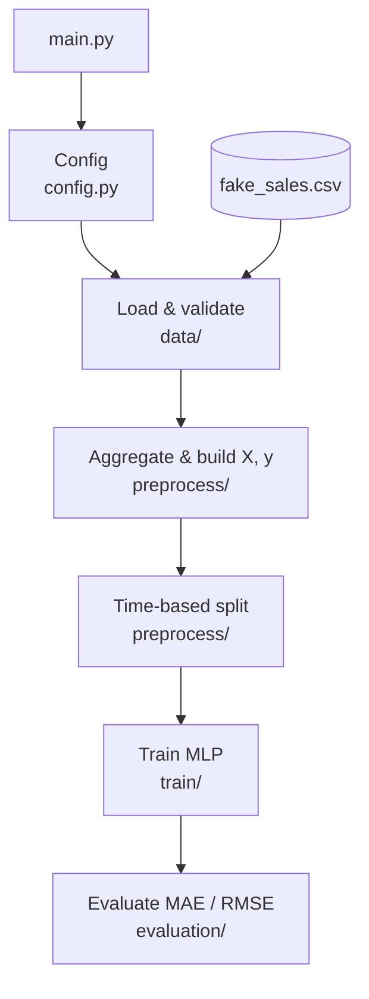

# M5 Monthly SKU Forecast

Projeto de previsão de demanda desenvolvido para a disciplina de Engenharia de Software da Especialização em Deep Learning (UFPE).

## Problema

Prever a **demanda mensal por SKU** (produto) a partir de histórico de vendas. O dataset de referência é o [M5 Forecasting](https://www.kaggle.com/competitions/m5-forecasting-accuracy) (Walmart), em que cada SKU corresponde ao `item_id` **agregado em todas as lojas** (`store_id`).

O M5 completo reúne mais de 3.000 produtos em 10 lojas — escala impraticável para o escopo do projeto. Por isso, trabalhamos com os **50 `item_id` de maior demanda total** (vendas somadas em todas as lojas e em todo o histórico disponível). Essa seleção prioriza SKUs com volume relevante e histórico longo, mantendo séries representativas da competição sem o custo de modelar o catálogo inteiro.

A análise em `notebooks/m5_series_analysis.ipynb` mostrou que, para esse subconjunto:

- o histórico cobre **jan/2011 – jun/2016** (~66 meses após agregação mensal), adequado para lags bastante amplos;
- a **intermitência é baixa** (poucos meses com demanda zero);
- há **sazonalidade e variabilidade** distintas entre SKUs, mas em geral compatíveis com previsão mensal tabular.

Os dados diários filtrados são exportados por `scripts/extract_m5.py` em `data/m5/processed/m5_daily_sales.parquet` (não versionado no repositório).

## Abordagem

1. Carregar vendas brutas (diárias) e agregar por mês e por SKU.
2. Transformar cada série temporal em um dataset tabular `(X, y)`:
  - **X**: lags históricos (1, 2, 3, 6 e 12 meses);
  - **y**: demanda do próximo mês (`horizon = 1`).
3. Dividir os dados com **split temporal orientado ao mês-alvo da previsão** (treino, validação e teste).
4. Treinar uma **MLP com PyTorch**.

### Parâmetros temporais

A configuração em `src/config.py` usa:

- `reference_month`: mês-alvo da previsão de referência (ex.: `2015-06` prevê demanda de jun/2015).
- `validation_months`: quantidade de meses-calendário imediatamente anteriores à referência usados para validação.
- `forecast_horizon`: deslocamento entre a data de origem da linha e o mês do alvo.

Com `reference_month="2015-06"`, `validation_months=6` e `forecast_horizon=1`:

- **Treino**: alvos anteriores a dez/2014.
- **Validação**: alvos de dez/2014 a mai/2015.
- **Teste/previsão**: alvos a partir de jun/2015 (inclui a previsão de referência).

## Estrutura do projeto

```text
forecasting-project/
├── src/
│   ├── main.py
│   ├── config.py
│   ├── data/
│   │   └── loader.py
│   ├── preprocess/
│   │   ├── transform.py
│   │   ├── scaler.py
│   │   └── split.py
│   ├── models/
│   │   └── neural.py
│   ├── train/
│   │   └── trainer.py
│   ├── evaluation/
│   │   └── metrics.py
│   └── utils/
│       └── pytorch.py
├── tests/
│   ├── test_metrics.py
│   ├── test_scaler.py
│   ├── test_split.py
│   └── test_transform.py
├── Makefile
├── data/
│   └── sample/
│       └── fake_sales.csv
├── README.md
└── requirements.txt
```

## Pipeline

O `src/main.py` orquestra o fluxo abaixo.




| Etapa                 | Módulo                    | Entrada                   | Saída                      |
| --------------------- | ------------------------- | ------------------------- | -------------------------- |
| Configuração          | `config`                  | —                         | `ProjectConfig`            |
| Carga                 | `data/loader`             | CSV diário                | `DataFrame` bruto          |
| Validação             | `data/loader`             | dados brutos              | schema validado            |
| Agregação             | `preprocess/transform` | vendas diárias            | série mensal por SKU       |
| Features              | `preprocess/transform` | série mensal              | dataset tabular + lags     |
| Split                 | `preprocess/split`     | dataset supervisionado    | treino / validação / teste |
| Scaling               | `preprocess/scaler`    | arrays NumPy              | X e y padronizados         |
| Treino                | `train/loop`           | DataLoaders               | modelo PyTorch             |
| Avaliação             | `evaluation/metrics`   | `y_true`, `y_pred`        | MAE, RMSE                  |


## Como executar

Execute todos os comandos a partir da **raiz do repositório**.

### Pré-requisitos

- [uv](https://docs.astral.sh/uv/) (gerenciador de dependências e ambiente virtual)
- `make` (já disponível no macOS/Linux; no Windows, use WSL ou [Make para Windows](https://gnuwin32.sourceforge.net/packages/make.htm))

### Primeira vez (clone do repositório)

```bash
make setup
```

Cria o `.venv`, resolve a versão do Python (`.python-version`) e instala dependências de runtime e desenvolvimento (incluindo Ruff).

Com dados de exemplo (`data/sample/fake_sales.csv`):

```bash
make run-project
```

Com o dataset M5 (download + preparação — gera `data/m5/processed/m5_daily_sales.parquet`):

```bash
make extract-data
make run-project
```

### Comandos do Makefile

| Comando | Descrição |
| --- | --- |
| `make setup` | Instala dependências (`uv sync --group dev`) |
| `make run-project` | Executa o pipeline de previsão (`src/main.py`) |
| `make run-tests` | Roda os testes unitários (`unittest`) |
| `make extract-data` | Baixa e prepara o dataset M5 (`scripts/extract_m5.py`) |
| `make check` | Lint com Ruff (`src`, `scripts`, `tests`) |
| `make format` | Formata o código com Ruff |

### Desenvolvimento

Fluxo típico após alterações no código:

```bash
make check        # lint
make run-tests    # testes
make format       # formatação (se necessário)
```

Os testes usam `PYTHONPATH=src` internamente, para que os imports (`from evaluation.metrics import ...`) funcionem sem instalar o projeto como pacote.

Equivalente manual dos testes:

```bash
PYTHONPATH=src uv run python -m unittest discover -s tests -v
```

### Alternativa com pip

Sem `uv`, use o `requirements.txt`:

```bash
python -m venv .venv
source .venv/bin/activate   # Windows: .venv\Scripts\activate
pip install -r requirements.txt
python src/main.py
```

Para testes com pip/venv ativo:

```bash
PYTHONPATH=src python -m unittest discover -s tests -v
```

Para lint com pip (instale o Ruff separadamente: `pip install ruff`):

```bash
ruff check src scripts tests
ruff format src scripts tests
```

## Decisões de design


| Tópico            | Decisão                                   |
| ----------------- | ----------------------------------------- |
| SKU               | `item_id` agregado em todas as `store_id` |
| Granularidade     | mensal                                    |
| Features iniciais | lags 1, 2, 3, 6 e 12                      |
| Horizonte         | 1 mês à frente                            |
| Split             | temporal por mês-alvo (`reference_month` + `validation_months`) |
| Modelo            | MLP (PyTorch)                             |


## Dados

- **Produção:** M5 Forecasting — top 50 SKUs por demanda total (`scripts/extract_m5.py` → `data/m5/processed/m5_daily_sales.parquet`).
- **Desenvolvimento:** `data/sample/fake_sales.csv` (3 SKUs, 2 lojas, jan/2014–dez/2015).

## Roadmap

- [x] Estrutura modular e funções com type hints (stubs)
- [x] Dataset fake de desenvolvimento
- [x] Implementação do pipeline de dados e features
- [x] Scaling de features e target (fit no treino)
- [x] Split temporal
- [x] Integração com M5 (extração e análise exploratória)
- [x] Modelo MLP com PyTorch
- [x] Testes unitários (`tests/`, `make run-tests`)
- [x] Lint e formatação com Ruff (`make check`, `make format`)